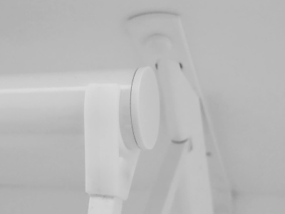
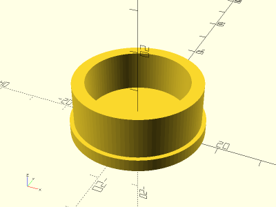

# Parametric Closet Rod End Cap

<table>
<tr>
<td></td>
<td></td>
</tr>
</table>

A simple parametric friction fit end cap for closet rods. Default parameters sized for [Closet-Pro™ 1-1/4" diameter closet rods](https://www.menards.com/main/storage-organization/closet-organizers/closet-organizers-accessories/closet-pro-trade-closet-rod/0018-4/p-1444436938795-c-12650.htm). Made with OpenSCAD.

**Design:** [closet_rod_endcap.scad](closet_rod_endcap.scad)

**STL:** [closet_rod_endcap.stl](stl/closet_rod_endcap.stl)

**Recommended Print Settings:** PLA+, 0.20mm layer height, 100% infill, no supports

**Thingiverse:** https://www.thingiverse.com/thing:6085457

**License**: 
